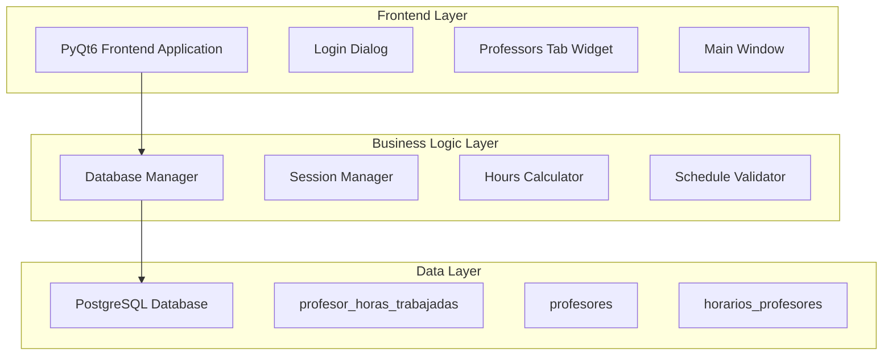
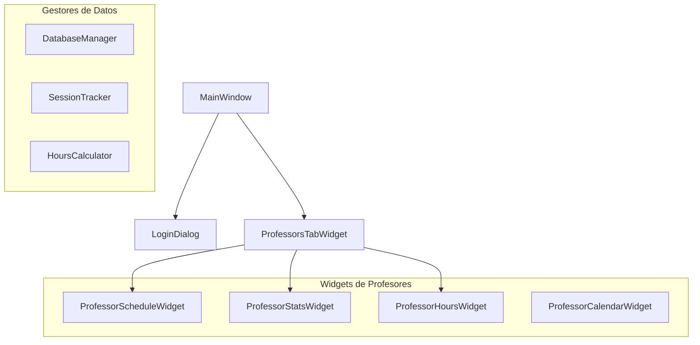
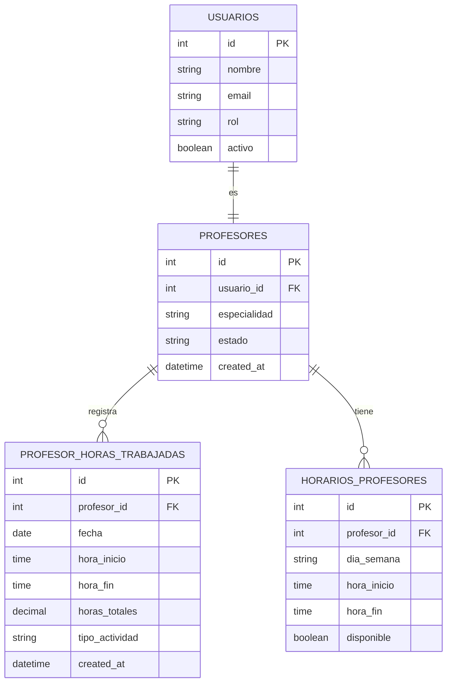

# Arquitectura Técnica - Sistema de Horas de Trabajo para Profesores

## 1. Diseño de Arquitectura



## 2. Descripción de Tecnologías

- **Frontend**: PyQt6 + Python 3.9+
- **Base de Datos**: PostgreSQL con psycopg2
- **Gestión de Sesiones**: Métodos nativos de database.py
- **Validación**: Validadores personalizados integrados

## 3. Definiciones de Rutas/Componentes

| Componente | Propósito |
|------------|----------|
| LoginDialog | Manejo de autenticación y inicio automático de sesiones de trabajo |
| ProfessorsTabWidget | Visualización de estadísticas y gestión de horarios |
| MainWindow.closeEvent | Finalización automática de sesiones al cerrar aplicación |
| Database.iniciar_sesion_trabajo_profesor | Registro de inicio de sesión de trabajo |
| Database.finalizar_sesion_trabajo_profesor | Registro de fin de sesión y cálculo de horas |

## 4. Definiciones de API/Métodos

### 4.1 Métodos de Base de Datos Principales

**Inicio de sesión de trabajo**
```python
iniciar_sesion_trabajo_profesor(profesor_id: int, tipo_actividad: str = 'musculacion') -> bool
```

Parámetros:
| Nombre | Tipo | Requerido | Descripción |
|--------|------|-----------|-------------|
| profesor_id | int | true | ID del profesor en la tabla profesores |
| tipo_actividad | string | false | Tipo de actividad (por defecto 'musculacion') |

Retorno:
| Nombre | Tipo | Descripción |
|--------|------|-------------|
| success | boolean | True si se inició correctamente la sesión |

**Finalización de sesión de trabajo**
```python
finalizar_sesion_trabajo_profesor(profesor_id: int) -> Dict[str, Any]
```

Parámetros:
| Nombre | Tipo | Requerido | Descripción |
|--------|------|-----------|-------------|
| profesor_id | int | true | ID del profesor |

Retorno:
| Nombre | Tipo | Descripción |
|--------|------|-------------|
| horas_trabajadas | float | Horas calculadas de la sesión |
| hora_inicio | datetime | Hora de inicio de la sesión |
| hora_fin | datetime | Hora de finalización |

**Obtener resumen de horas mensuales**
```python
obtener_resumen_horas_profesor(profesor_id: int, mes: int = None, año: int = None) -> Dict
```

Parámetros:
| Nombre | Tipo | Requerido | Descripción |
|--------|------|-----------|-------------|
| profesor_id | int | true | ID del profesor |
| mes | int | false | Mes específico (por defecto mes actual) |
| año | int | false | Año específico (por defecto año actual) |

Retorno:
```json
{
  "totales": {
    "total_sesiones": 15,
    "total_horas": 120.5
  },
  "por_tipo_actividad": [
    {
      "tipo_actividad": "musculacion",
      "total_sesiones": 15,
      "total_horas": 120.5,
      "promedio_horas_sesion": 8.03
    }
  ],
  "mes": 12,
  "año": 2024
}
```

### 4.2 Métodos de Validación y Cálculo

**Detectar horas fuera de horario**
```python
calcular_horas_fuera_horario(profesor_id: int, fecha_inicio: datetime, fecha_fin: datetime) -> float
```

**Verificar sesiones abiertas**
```python
verificar_sesiones_abiertas() -> List[Dict]
```

## 5. Arquitectura de Componentes Frontend



## 6. Modelo de Datos

### 6.1 Definición del Modelo de Datos



### 6.2 Lenguaje de Definición de Datos (DDL)

**Tabla profesor_horas_trabajadas (ya existe)**
```sql
-- La tabla ya está creada, pero verificar índices
CREATE INDEX IF NOT EXISTS idx_profesor_horas_profesor_fecha 
ON profesor_horas_trabajadas(profesor_id, fecha DESC);

CREATE INDEX IF NOT EXISTS idx_profesor_horas_mes_año 
ON profesor_horas_trabajadas(profesor_id, EXTRACT(YEAR FROM fecha), EXTRACT(MONTH FROM fecha));

-- Función para calcular horas fuera de horario
CREATE OR REPLACE FUNCTION calcular_horas_fuera_horario(
    p_profesor_id INTEGER,
    p_fecha DATE,
    p_hora_inicio TIME,
    p_hora_fin TIME
) RETURNS DECIMAL AS $$
DECLARE
    horas_programadas DECIMAL := 0;
    horas_trabajadas DECIMAL;
    horas_fuera DECIMAL := 0;
BEGIN
    -- Calcular horas trabajadas
    horas_trabajadas := EXTRACT(EPOCH FROM (p_hora_fin - p_hora_inicio)) / 3600;
    
    -- Obtener horas programadas para ese día
    SELECT COALESCE(SUM(EXTRACT(EPOCH FROM (hora_fin - hora_inicio)) / 3600), 0)
    INTO horas_programadas
    FROM horarios_profesores
    WHERE profesor_id = p_profesor_id
    AND dia_semana = CASE EXTRACT(DOW FROM p_fecha)
        WHEN 0 THEN 'Domingo'
        WHEN 1 THEN 'Lunes'
        WHEN 2 THEN 'Martes'
        WHEN 3 THEN 'Miércoles'
        WHEN 4 THEN 'Jueves'
        WHEN 5 THEN 'Viernes'
        WHEN 6 THEN 'Sábado'
    END
    AND disponible = true;
    
    -- Si trabajó más horas de las programadas
    IF horas_trabajadas > horas_programadas THEN
        horas_fuera := horas_trabajadas - horas_programadas;
    END IF;
    
    RETURN horas_fuera;
END;
$$ LANGUAGE plpgsql;

-- Trigger para calcular automáticamente horas_totales
CREATE OR REPLACE FUNCTION calcular_horas_totales()
RETURNS TRIGGER AS $$
BEGIN
    IF NEW.hora_fin IS NOT NULL AND NEW.hora_inicio IS NOT NULL THEN
        NEW.horas_totales := EXTRACT(EPOCH FROM (NEW.hora_fin - NEW.hora_inicio)) / 3600;
    END IF;
    RETURN NEW;
END;
$$ LANGUAGE plpgsql;

CREATE TRIGGER trigger_calcular_horas_totales
    BEFORE INSERT OR UPDATE ON profesor_horas_trabajadas
    FOR EACH ROW
    EXECUTE FUNCTION calcular_horas_totales();
```

**Datos de configuración inicial**
```sql
-- Configuraciones para el sistema de horas
INSERT INTO configuraciones (clave, valor, descripcion) VALUES
('max_horas_sesion', '12', 'Máximo de horas por sesión antes de alerta'),
('alerta_horas_fuera_horario', 'true', 'Activar alertas por horas fuera de horario'),
('reset_mensual_automatico', 'true', 'Reset automático de contadores mensuales')
ON CONFLICT (clave) DO NOTHING;
```