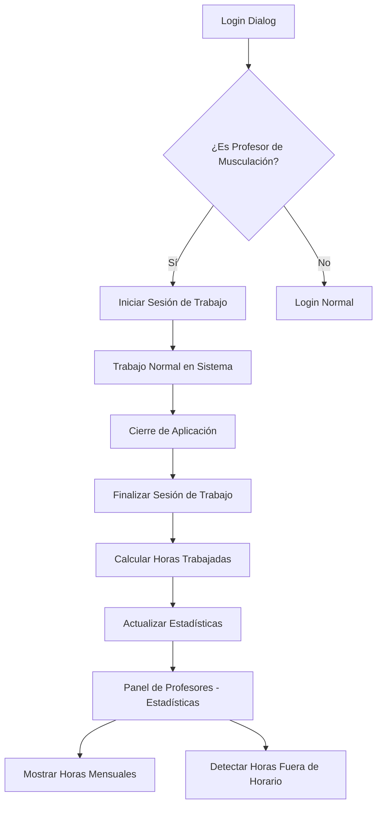

# Sistema de Seguimiento de Horas de Trabajo para Profesores

## 1. Resumen del Producto

Sistema integral de seguimiento de horas de trabajo para profesores que registra automáticamente las sesiones de trabajo basadas en login/logout real, calcula horas mensuales trabajadas y detecta trabajo fuera de horarios programados. El sistema proporciona métricas precisas para gestión de recursos humanos y cumplimiento laboral.

## 2. Características Principales

### 2.1 Roles de Usuario

| Rol | Método de Registro | Permisos Principales |
|-----|-------------------|----------------------|
| Profesor de Musculación | Login con credenciales existentes | Inicio/fin automático de sesión de trabajo, visualización de horas propias |
| Dueño/Administrador | Login con credenciales de dueño | Visualización de horas de todos los profesores, reportes mensuales |

### 2.2 Módulos de Funcionalidad

Nuestro sistema de horas para profesores consta de las siguientes páginas principales:

1. **Login Dialog**: Inicio automático de sesión de trabajo para profesores de musculación
2. **Panel de Profesores**: Visualización de estadísticas de horas trabajadas y gestión de horarios
3. **Widget de Estadísticas**: Métricas en tiempo real de horas mensuales y alertas
4. **Sistema de Seguimiento**: Registro automático de sesiones de trabajo en segundo plano

### 2.3 Detalles de Páginas

| Página | Módulo | Descripción de Funcionalidad |
|--------|--------|------------------------------|
| Login Dialog | Inicio de Sesión Automático | Detectar login de profesor de musculación, iniciar sesión de trabajo automáticamente, mostrar confirmación visual |
| Panel de Profesores | Widget de Estadísticas | Mostrar horas trabajadas del mes actual, calcular horas fuera de horario programado, resetear contador mensualmente |
| Panel de Profesores | Gestión de Horarios | Mantener horarios programados separados del seguimiento de horas reales, validar superposiciones |
| Sistema Principal | Cierre de Sesión | Finalizar sesión de trabajo automáticamente al cerrar aplicación, calcular horas totales de la sesión |
| Panel de Profesores | Alertas y Notificaciones | Mostrar alertas de horas fuera de horario, notificar sesiones largas (>12 horas), resumen mensual |

## 3. Flujo Principal del Sistema

### Flujo de Profesor:
1. Profesor inicia sesión en Login Dialog
2. Sistema detecta automáticamente si es profesor de musculación
3. Se inicia sesión de trabajo automáticamente en tabla profesor_horas_trabajadas
4. Profesor trabaja normalmente en el sistema
5. Al cerrar la aplicación, se finaliza automáticamente la sesión de trabajo
6. Sistema calcula horas trabajadas y las almacena
7. En Panel de Profesores se muestran estadísticas actualizadas

### Flujo de Administrador:
1. Administrador accede al Panel de Profesores
2. Selecciona profesor específico
3. Ve estadísticas de horas mensuales del profesor
4. Revisa alertas de horas fuera de horario
5. Puede generar reportes mensuales

## 4. Diseño de Interfaz de Usuario

### 4.1 Estilo de Diseño

- **Colores Primarios**: Azul profesional (#2563eb), Verde éxito (#16a34a)
- **Colores Secundarios**: Gris neutro (#6b7280), Naranja alerta (#ea580c)
- **Estilo de Botones**: Redondeados con sombras sutiles
- **Fuentes**: Sistema por defecto, tamaños 12px-16px para texto, 18px-24px para títulos
- **Layout**: Basado en tarjetas con navegación por pestañas
- **Iconos**: Lucide React con estilo minimalista

### 4.2 Resumen de Diseño de Páginas

| Página | Módulo | Elementos de UI |
|--------|--------|----------------|
| Login Dialog | Confirmación de Sesión | Badge verde "Sesión iniciada" con icono de reloj, animación sutil de fade-in |
| Panel de Profesores | Widget de Estadísticas | Tarjeta con métricas: "Horas del Mes", "Horas Fuera de Horario", "Última Sesión", colores dinámicos según valores |
| Panel de Profesores | Alertas | Lista de alertas con iconos de advertencia, colores naranja/rojo según severidad |
| Panel de Profesores | Resumen Mensual | Gráfico de barras simple, tabla de resumen con totales |

### 4.3 Responsividad

El sistema está diseñado desktop-first con adaptación para pantallas medianas. No requiere optimización táctil ya que es una aplicación de escritorio PyQt6.