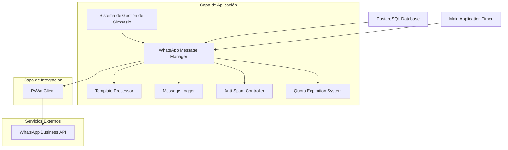
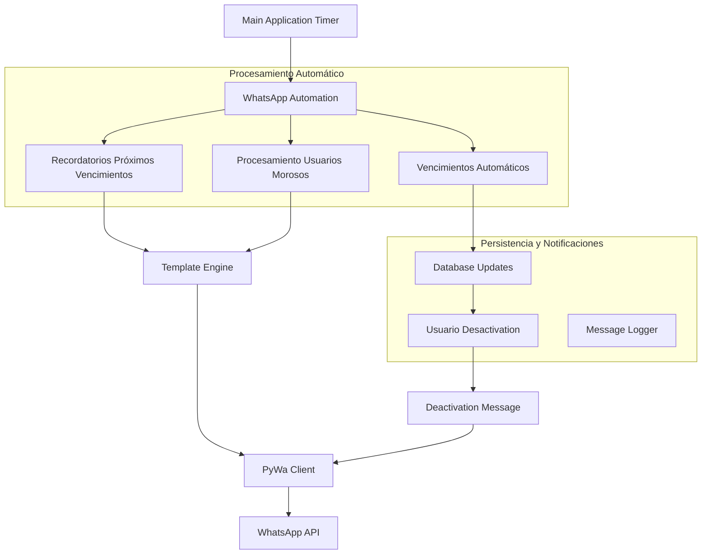
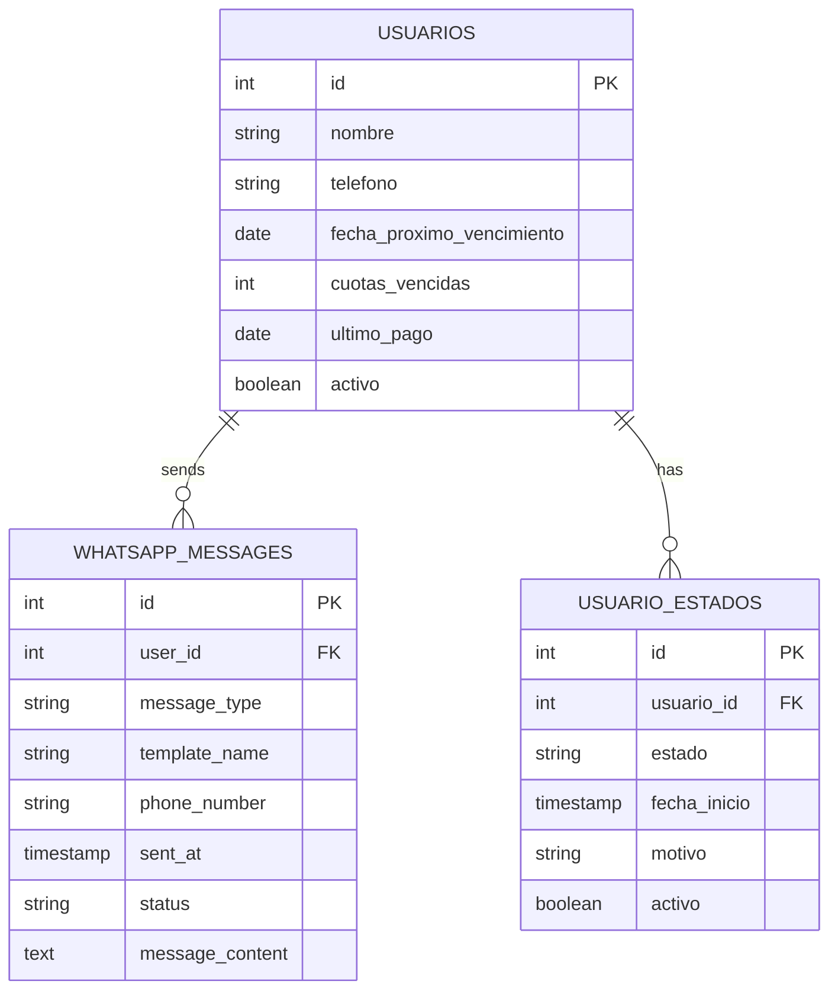

# Sistema de Mensajería WhatsApp Business - Arquitectura Técnica

## 1. Diseño de Arquitectura



## 2. Descripción de Tecnologías

- Frontend: Integración con PyQt6 existente
- Backend: Python 3.8+ con PyWa 3.0.0
- Base de datos: PostgreSQL (existente)
- API Externa: WhatsApp Business API vía PyWa
- Automatización: Timer integrado en main.py para mayor estabilidad

## 3. Definiciones de Rutas/Módulos

| Módulo | Propósito |
|--------|----------|
| whatsapp_manager.py | Gestor principal de mensajería WhatsApp |
| template_processor.py | Procesamiento y reemplazo de variables en plantillas |
| message_logger.py | Registro y control de mensajes enviados |
| main.py | Timer automático para procesamiento de recordatorios y cuotas vencidas |

## 4. Sistema de Cuotas Vencidas - IMPLEMENTADO

### 4.1 Lógica de Vencimiento
- **Duración de cuota**: Exactamente 1 mes desde el último pago
- **Fecha de registro**: Se considera como primer pago para nuevos usuarios
- **Contador de cuotas vencidas**: Se incrementa automáticamente cuando vence una cuota
- **Desactivación automática**: Ocurre al llegar a 3 cuotas vencidas consecutivas
- **Reset del contador**: Se resetea a 0 cuando el usuario realiza un pago

### 4.2 Campos de Base de Datos Agregados
```sql
-- Nuevos campos en tabla usuarios
ALTER TABLE usuarios ADD COLUMN fecha_proximo_vencimiento DATE;
ALTER TABLE usuarios ADD COLUMN cuotas_vencidas INTEGER DEFAULT 0;
```

### 4.3 Procesamiento Automático
- **Frecuencia**: Cada hora desde main.py
- **Recordatorios**: 3 días antes del vencimiento
- **Procesamiento de morosos**: Usuarios con cuotas ya vencidas
- **Desactivación automática**: Al llegar a 3 cuotas vencidas

## 5. Definiciones de API y Métodos

### 5.1 WhatsApp Manager Core - ACTUALIZADO

**Procesamiento de Recordatorios de Próximos Vencimientos**
```python
def procesar_recordatorios_proximos_vencimientos(self) -> int:
    """
    Procesa y envía recordatorios a usuarios cuyas cuotas vencen en 3 días
    
    Returns:
        int: Número de recordatorios enviados
    """
```

**Procesamiento de Usuarios Morosos**
```python
def procesar_usuarios_morosos(self) -> int:
    """
    Procesa usuarios con cuotas vencidas, incrementa contadores y desactiva si es necesario
    
    Returns:
        int: Número de usuarios procesados
    """
```

**Envío de Mensaje de Desactivación - NUEVO**
```python
def send_deactivation_message(self, user_data: dict) -> bool:
    """
    Envía mensaje de desactivación a usuario (preparado para futura plantilla oficial)
    
    Args:
        user_data: {
            'phone': str,
            'name': str,
            'reason': str,
            'gym_name': str
        }
    
    Returns:
        bool: True si el mensaje se envió correctamente
    """
```

### 5.2 Database Manager - NUEVOS MÉTODOS

**Actualización de Fecha de Próximo Vencimiento**
```python
def actualizar_fecha_proximo_vencimiento(self, usuario_id: int, fecha_pago: date = None) -> bool:
    """
    Actualiza la fecha de próximo vencimiento basada en el último pago (1 mes después)
    Resetea el contador de cuotas vencidas a 0
    """
```

**Obtención de Usuarios con Cuotas por Vencer**
```python
def obtener_usuarios_con_cuotas_por_vencer(self, dias_anticipacion: int = 3) -> List[Dict[str, Any]]:
    """
    Obtiene usuarios cuyas cuotas vencen en los próximos días especificados
    """
```

**Obtención de Usuarios Morosos**
```python
def obtener_usuarios_morosos(self) -> List[Dict[str, Any]]:
    """
    Obtiene usuarios con cuotas vencidas (fecha_proximo_vencimiento pasada)
    """
```

**Procesamiento Automático de Vencimientos**
```python
def procesar_vencimientos_automaticos(self) -> Dict[str, int]:
    """
    Procesa automáticamente los vencimientos de cuotas y desactivaciones
    Incrementa contadores y desactiva usuarios con 3 cuotas vencidas
    """
```

### 5.3 Main Application - AUTOMATIZACIÓN

**Procesamiento Automático desde Main.py**
```python
def process_whatsapp_automation(self):
    """
    Procesa automáticamente recordatorios de WhatsApp y cuotas vencidas
    Se ejecuta cada hora desde un QTimer en main.py
    """
```

## 6. Arquitectura del Servidor - ACTUALIZADA



## 7. Modelo de Datos - ACTUALIZADO

### 7.1 Definición del Modelo de Datos



### 7.2 Definición de Lenguaje de Datos (DDL) - ACTUALIZADA

**Campos Agregados a Tabla Usuarios**
```sql
-- Agregar campos para sistema de cuotas vencidas
ALTER TABLE usuarios ADD COLUMN fecha_proximo_vencimiento DATE;
ALTER TABLE usuarios ADD COLUMN cuotas_vencidas INTEGER DEFAULT 0;

-- Crear índices para optimizar consultas
CREATE INDEX idx_usuarios_fecha_vencimiento ON usuarios(fecha_proximo_vencimiento);
CREATE INDEX idx_usuarios_cuotas_vencidas ON usuarios(cuotas_vencidas);
```

**Plantillas de WhatsApp Existentes**
```sql
-- Plantillas ya implementadas en WhatsApp Business Manager
INSERT INTO whatsapp_templates (template_name, header_text, body_text, variables) VALUES
('aviso_de_vencimiento_de_cuota_gimnasio_para_usuario_especifico_en_sistema_de_management_de_gimnasios_profesional', 
 'Vencimiento de cuota', 
 'Hola {{1}}, recordá que tu cuota vence el {{2}}. El monto actual de tu cuota es de $ {{3}}. Saludos!',
 '{"1": "nombre_completo", "2": "fecha_vencimiento", "3": "monto_cuota"}'),

('aviso_de_confirmacion_de_pago_de_cuota_gimnasio_para_usuario_especifico_en_sistema_de_management_de_gimnasios_profesional',
 'Confirmación de Pago',
 'Información de pago:\nNombre: {{1}}\nMonto: $ {{2}}\nFecha {{3}}\n\nSaludos!',
 '{"1": "nombre_completo", "2": "monto_cuota", "3": "fecha_pago"}'),

('mensaje_de_bienvenida_a_gimnasio_para_usuario_especifico_en_sistema_de_management_de_gimnasios_profesional',
 '',
 'Hola {{1}}. Bienvenido al {{2}} !\n\nSi recibiste este mensaje por error, contactate por este mismo medio.',
 '{"1": "nombre_completo", "2": "nombre_gimnasio"}');

-- NOTA: Plantilla de desactivación pendiente de creación en WhatsApp Business Manager
-- 'mensaje_de_desactivacion_de_usuario_por_morosidad_en_sistema_de_management_de_gimnasios_profesional'
```

## 8. Flujo de Procesamiento Automático

### 8.1 Inicialización del Sistema
1. **Registro de Usuario**: Se establece `fecha_proximo_vencimiento` = fecha_registro + 1 mes
2. **Registro de Pago**: Se actualiza `fecha_proximo_vencimiento` = fecha_pago + 1 mes y se resetea `cuotas_vencidas` = 0

### 8.2 Procesamiento Automático (Cada Hora)
1. **Recordatorios de Próximos Vencimientos**:
   - Buscar usuarios con `fecha_proximo_vencimiento` en 3 días
   - Verificar anti-spam (1 recordatorio por semana)
   - Enviar plantilla de vencimiento

2. **Procesamiento de Usuarios Morosos**:
   - Buscar usuarios con `fecha_proximo_vencimiento` < fecha_actual
   - Verificar anti-spam (1 mensaje por mes)
   - Incrementar `cuotas_vencidas`
   - Si `cuotas_vencidas` >= 3: desactivar usuario y enviar mensaje

3. **Desactivación Automática**:
   - Establecer `activo` = FALSE
   - Crear registro en `usuario_estados` con estado 'desactivado_por_morosidad'
   - Enviar mensaje de desactivación (usando mensaje simple hasta crear plantilla oficial)

## 9. Compatibilidad y Migración

### 9.1 Sistemas Obsoletos
- `verificar_vencimientos_cuotas_automatico()`: Marcado como obsoleto, redirige al nuevo sistema
- Métodos antiguos de procesamiento: Reemplazados por nueva lógica centralizada

### 9.2 Migración de Datos
- Los campos nuevos se agregan automáticamente en la inicialización
- Usuarios existentes sin `fecha_proximo_vencimiento` se actualizan en el próximo pago
- Sistema compatible con datos existentes

## 10. Configuración y Mantenimiento

### 10.1 Configuración de Timers
- **Timer principal**: 3600000 ms (1 hora) en main.py
- **Ejecución inicial**: 300000 ms (5 minutos) después del inicio
- **Anti-spam recordatorios**: 7 días entre mensajes
- **Anti-spam morosos**: 30 días entre mensajes

### 10.2 Logging y Monitoreo
- Todos los procesos automáticos se registran en logs
- Alertas del sistema para actividad significativa
- Estadísticas disponibles en WhatsApp Config Widget

### 10.3 Futuras Implementaciones
- **Plantilla de desactivación oficial**: Pendiente de creación en WhatsApp Business Manager
- **Nuevos tipos de mensaje**: Extensible agregando tipos en `message_logger.py`
- **Configuración de intervalos**: Parametrizable desde configuración del sistema
```