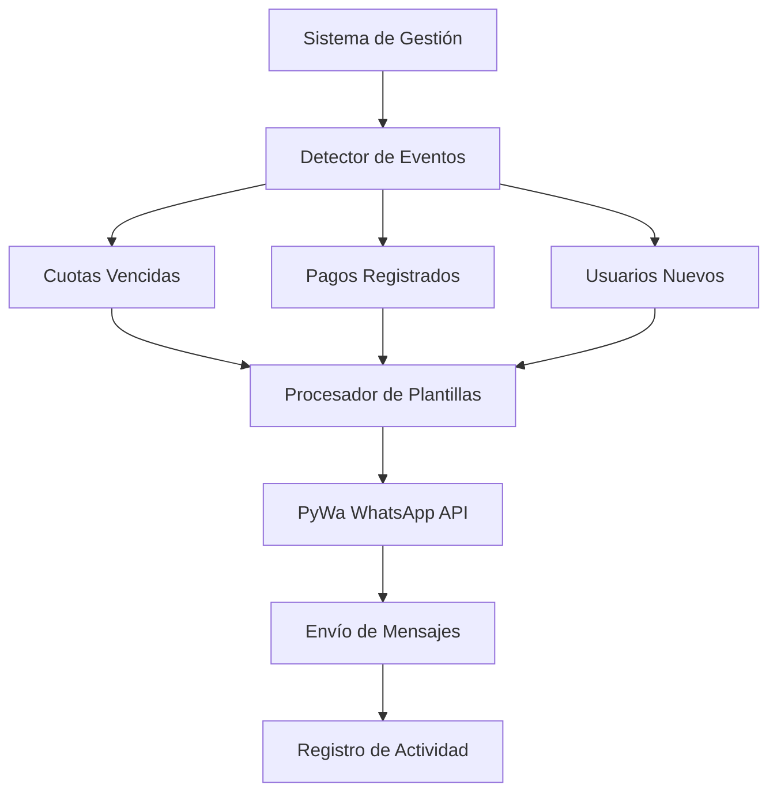

# Sistema de Mensajería WhatsApp Business - Requisitos del Producto

## 1. Descripción General del Producto

Sistema automatizado de mensajería WhatsApp Business integrado al sistema de gestión de gimnasio existente, que envía notificaciones automáticas sobre cuotas vencidas, confirmaciones de pago y mensajes de bienvenida a usuarios nuevos.

El sistema utiliza la API oficial de WhatsApp Business a través de la librería PyWa para mantener comunicación directa con los miembros del gimnasio, optimizando la gestión de pagos y mejorando la experiencia del usuario.

## 2. Funcionalidades Principales

### 2.1 Roles de Usuario

| Rol | Método de Acceso | Permisos Principales |
|-----|------------------|----------------------|
| Sistema Automático | Integración directa con payment_manager.py | Envío automático de mensajes según eventos |
| Administrador | Acceso desde interfaz principal | Configuración y monitoreo del sistema |

### 2.2 Módulos de Funcionalidad

Nuestro sistema de mensajería WhatsApp consta de los siguientes módulos principales:

1. **Detector de Cuotas Vencidas**: Integración con sistema de alertas existente, envío de recordatorios de pago
2. **Confirmador de Pagos**: Notificación automática al registrar pagos, confirmación de transacciones
3. **Sistema de Bienvenida**: Mensaje automático para usuarios nuevos, información inicial del gimnasio

### 2.3 Detalles de Funcionalidades

| Módulo | Funcionalidad | Descripción |
|--------|---------------|-------------|
| Detector de Cuotas Vencidas | Monitoreo Automático | Detecta usuarios con cuotas vencidas usando payment_manager.obtener_usuarios_morosos() |
| Detector de Cuotas Vencidas | Envío de Recordatorios | Envía un mensaje por cuota vencida usando plantilla específica con datos del usuario |
| Detector de Cuotas Vencidas | Control Anti-Spam | Registra mensajes enviados para evitar duplicados por el mismo período |
| Confirmador de Pagos | Detección de Pagos | Escucha eventos de registro de pagos desde payment_manager |
| Confirmador de Pagos | Confirmación Automática | Envía mensaje de confirmación con detalles del pago realizado |
| Sistema de Bienvenida | Detección de Usuarios Nuevos | Detecta registro de nuevos usuarios en el sistema |
| Sistema de Bienvenida | Mensaje de Bienvenida | Envía mensaje personalizado con nombre del usuario y gimnasio |

## 3. Flujo Principal del Sistema

El sistema opera de manera automática mediante la integración con los eventos del sistema de gestión existente:

1. **Detección de Eventos**: El sistema monitorea continuamente eventos de cuotas vencidas, pagos registrados y usuarios nuevos
2. **Procesamiento de Plantillas**: Selecciona la plantilla apropiada y reemplaza variables con datos del usuario
3. **Envío de Mensajes**: Utiliza PyWa para enviar mensajes a través de WhatsApp Business API
4. **Registro de Actividad**: Documenta mensajes enviados para control anti-spam

## 4. Diseño de Interfaz de Usuario

### 4.1 Estilo de Diseño

- **Colores**: Integración con tema existente del sistema de gestión
- **Estilo de Botones**: Consistente con interfaz actual (botones redondeados)
- **Fuente**: Fuente del sistema, tamaño estándar 12px
- **Layout**: Panel de configuración integrado en pestaña de configuración existente
- **Iconos**: Iconos de WhatsApp y notificaciones para identificación visual

### 4.2 Elementos de Interfaz

| Sección | Elemento | Descripción de UI |
|---------|----------|-------------------|
| Panel de Configuración | Estado del Servicio | Indicador verde/rojo del estado de conexión con WhatsApp API |
| Panel de Configuración | Configuración de Credenciales | Campos para phone_id, waba_id y token de acceso |
| Panel de Monitoreo | Log de Mensajes | Lista de mensajes enviados con timestamp y estado |
| Panel de Monitoreo | Estadísticas | Contadores de mensajes por tipo (vencidas, pagos, bienvenida) |

### 4.3 Responsividad

El sistema se integra completamente con la interfaz desktop existente del sistema de gestión de gimnasio, manteniendo consistencia visual y funcional.